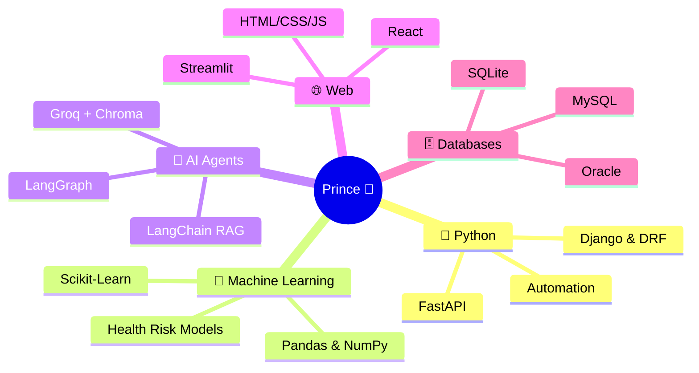
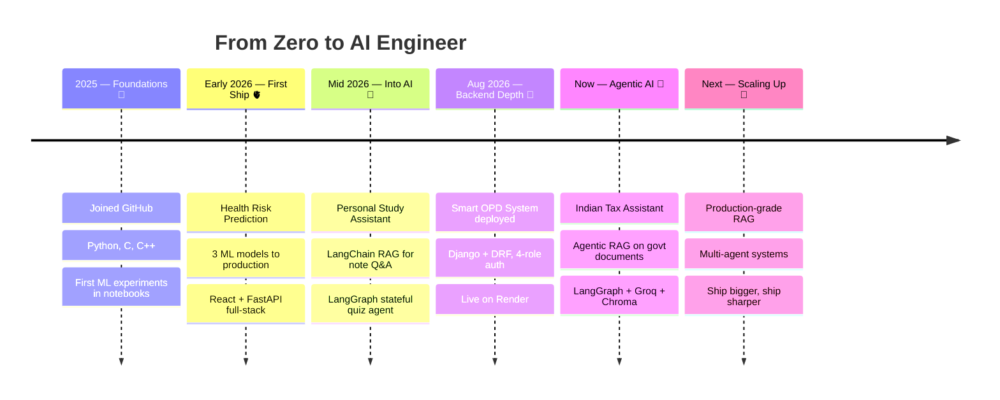

<div align="center">


<br/>


</div>

<br/>

## 👨‍💻 About Me

```python
class Prince:
    def __init__(self):
        self.name     = "Panchal Prince"
        self.role     = "Python Developer | ML Engineer"
        self.mission  = "Build intelligent apps with ML & AI"
        self.learning = ["Agentic RAG", "LangGraph", "FastAPI", "React"]
        self.building = "Indian Tax Assistant 🧾"

    def current_status(self):
        return "Probably debugging... it's always the typo 🐛"

    def say_hi(self):
        print("Thanks for dropping by — let's build something!")
```

- 🚀 Building **Python web applications** and **machine learning models**
- 🤖 Shipped projects across **ML prediction, RAG pipelines & AI agents**
- 🧾 Currently building an **agentic RAG tax assistant** on official Indian govt documents
- 🌱 Deep-diving into **AI agents** (LangGraph) and **production RAG** pipelines
- 📫 Reach me: **panchalprince2512@gmail.com**

<br/>

## 🧠 My Tech Universe



## 📈 Learning Loadout — Live Progress

```text
Django & DRF        ██████████████░░░░░░  Smart OPD System shipped & deployed
Machine Learning    ██████████████░░░░░░  3 models shipped to production
LangChain / RAG     ██████████████░░░░░░  2 RAG systems built end to end
AI Agents           ████████████░░░░░░░░  LangGraph agents running in production
React               ██████████░░░░░░░░░░  frontends for ML + tax assistant
```

## 🛠️ Tech Stack

<div align="center">

### 👨‍💻 Languages


### 🌐 Web & Frameworks


### 🤖 ML & AI


### 🗄️ Databases & Tools


</div>

## 🚀 Featured Projects

<table>
<tr>
<td width="50%" valign="top" align="center">

### 🧾 Indian Tax Assistant

<a href="https://github.com/prince220504/Indian-Text-Assistant"></a>


**Agentic RAG** chatbot answering Indian tax questions straight from official government documents — grounded, cited answers.

`LangGraph` `Groq` `ChromaDB` `FastAPI` `React`

</td>
<td width="50%" valign="top" align="center">

### 🏥 Smart OPD System

<a href="https://github.com/prince220504/Smart-Opd-Managment-System"></a>
<a href="https://smart-opd-managment-system.onrender.com/"></a>

Hospital platform — **4-role auth** (Doctor/Receptionist/Lab/Patient), appointment booking, lab reports, prescriptions. **Live on Render.**

`Python` `Django` `DRF` `MySQL`

</td>
</tr>
<tr>
<td width="50%" valign="top" align="center">

### 🫀 Health Risk Prediction

<a href="https://github.com/prince220504/Health-risk-prediction"></a>
<a href="http://health-risk-predictor-system.vercel.app/"></a>

AI-powered full-stack app predicting **diabetes, heart disease & stroke** probability with interactive dashboard.

`React` `FastAPI` `Scikit-Learn`

</td>
<td width="50%" valign="top" align="center">

### 🧠 Study Assistant

<a href="https://github.com/prince220504/Personal-Study-Assistant"></a>


**LangChain RAG** pipeline for note Q&A + **LangGraph** stateful quiz agent. 100% free-tier stack.

`LangChain` `Groq` `Streamlit`

</td>
</tr>
</table>

## 🗺️ Developer Journey



## 📊 GitHub Analytics

<div align="center">

<!--   -->
<!--   -->

<br/><br/>


 

</div>

## ⚡ Fun Facts & Fuel

<div align="center">


</div>

- 🎯 From **ML models** to **RAG pipelines** to **full-stack apps** — I like building end to end
- 🆓 My AI study assistant runs on a **100% free-tier stack** — constraints breed creativity
- 🐛 Debugging rule: *"It's never the framework. It's always my typo."*
- 🤝 I build with AI as my pair programmer — ship faster, learn deeper

## 🤝 Connect With Me

<div align="center">


<br/>

<a href="mailto:panchalprince2512@gmail.com"></a>
<a href="https://www.linkedin.com/in/prince-panchal-cs2026"></a>
<a href="https://github.com/prince220504"></a>

<br/><br/>

*"First, solve the problem. Then, write the code."* — John Johnson


</div>
